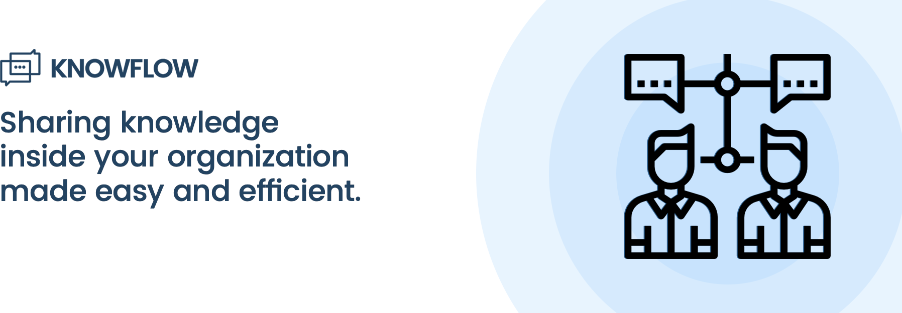

# Know-Flow

Many organizations (including ours) are struggling with the imbalance in information flow. Why did we decide to create another platform for knowledge sharing? Because we want everybody to have an equal opportunity to learn. Our experience shows that group meetings might be ineffective.  On the other hand, online courses are usually long, and finding something useful is hard. Our solution is based on short user-created stories and easy to use communication loop between mentor and student. How does it work? Just grab a coffee, select your story and start learning. Before you finish your beverage, you'll gain some new knowledge. It's that fast & easy.  If you don't understand everything - mark your problems and your mentor will try to help you.

TLDR

* our solution is based on short notes, which are easy to create (we have templates)
* short notes = small amount of time needed to learn = learning new things easier
* if something is unclear, user can contact creator of the note and ask for help
* you can track if everyone in the team have read your note
* you can create company standards and have them in one place
* we support various types of notes: simple list of steps, code snippets, videos and audio files

You can see our prototype here: [Know-Flow demo](https://landing--know-flow-staging.syncano.site)

## Project created during HackYeah 2018 by:

* [Maciej Korsan](https://github.com/maciejkorsan])
* [Konrad Kotelczuk](https://github.com/kkotelczuk)
* [Maciej Kucharz](https://github.com/mkucharz])
* [Kasper Mikiewicz](https://github.com/idered])
